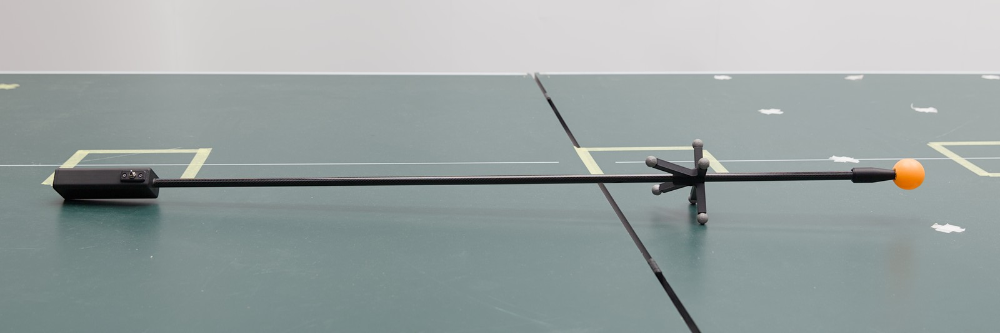

.. _tennicam_vicon_transform:

**************************************************************
More info: Compute Transformation from Tennicam to World Frame
**************************************************************

The :doc:`tennicam ball tracking <C5_visual_ball_tracking>` is done by a
separate camera system and thus it's reference frame does not naturally coincide
with the :ref:`world frame defined by Vicon <lab_world_frame>`.  Therefore, a
transformation from tennicam's reference frame to the world frame needs to be
determined.

This is done a two-step process:

1. Record a synchronised trajectory with tennicam and Vicon.
2. Compute the transformation from the trajectories.

Record Synchronised Trajectory
==============================

To record a synchronised trajectory, use the LED stick for the Vicon system with
a ball attached to the tip.  The centre of the ball should coincide with the
origin of the LED stick Vicon marker (at the tip of the stick):

The idea is that both ball tracking and Vicon will report the same physical
position, each in their respective reference frame.  When moving around and
recording positions, we get a synchronised trajectory from both systems from
which we can then compute the transformation between the two systems.
Since Vicon poses are already provided in the lab's world frame, this implicitly
gives us the transformation from tennicam to world.

To record, perform the following steps:

1. Start start both Vicon (see :ref:`start_vicon`) and the ball tracking
   (see :ref:`start_tennicam`).

2. Configure tennicam_client to *not* apply a transformation on the ball
   positions by setting both translation and rotation to zero in
   ``~/.mpi-is/pam/tennicam_client/config.toml``:

   .. code-block:: toml
   
      [transform]
      translation = [0,0,0]
      rotation = [0,0,0]

   This is important as otherwise a wrong transformation will be computed in the
   end.

3. Run the following commands in separate terminals.  They start o80 back ends
   that connected to the respective systems (see the label on the Vicon PC for its IP):

   ::

      tennicam_client

   ::

      vicon_o80_standalone <vicon-ip>

4. Start the script to record the data:

   ::

      record_tennicam_vicon_trajectory trajectory.json

5. Now *slowly* move the LED stick with the attached ball through the scene to
   get position measurements from different parts of the robot area. In case one
   of the systems does not detect the position (e.g. because of occlusion) a
   warning will be printed in the terminal.  This is not a problem, though, you
   can simply continue by moving to an area that is observed by both camera
   systems.

6. When finished, you can stop recording by pressing Ctrl+C.  The recorded
   points will be saved to the specified file (``trajectory.json``).  This file
   can be used to compute the transformation in the next step.

Compute Transformation
======================

To compute the transformation from tennicam's reference frame to Vicon's
reference frame (which coincides with the world frame), simply run the following
command on the file recorded in the previous step:

::

   compute_tennicam_to_vicon_transform trajectory.json

It will print the resulting transformation in a format that can directly be
copy-pasted into the config file of tennicam_client (see
:ref:`tennicam_client_config_transform`):

::

    [2023-02-24 16:08:46.155] [root] [info] Loaded trajectory with 52 steps.
    [2023-02-24 16:08:46.155] [root] [info] Mean error: 0.01898844376609573

    [transform]
    translation = [0.385887, 0.185144, -0.425765]
    # extrinsic xyz Euler angles
    rotation = [0.00499201, -0.0156143, -0.0121934]

If you restart ``tennicam_client`` with the updated configuration, it should now
report ball positions with respect to the lab's world frame.

.. note::

   The output of ``compute_tennicam_to_vicon_transform`` also shows the mean
   error of the computed transformation.  If you get a large value here, this
   might indicate that there is a problem with the recorded trajectory.  In this
   case restart the procedure with recording a new trajectory.

   To give some orientation: The expected error of tennicam is around 1-3 cm so
   a transformation error within that order of magnitude is okay.

Involved Packages
=================

The applications used in these instructions are provided by the packages
``tennicam_client`` (for the ``tennicam_client`` exectuable) and :doc:`pam_vicon
<pam_vicon:index>` (for the rest).
